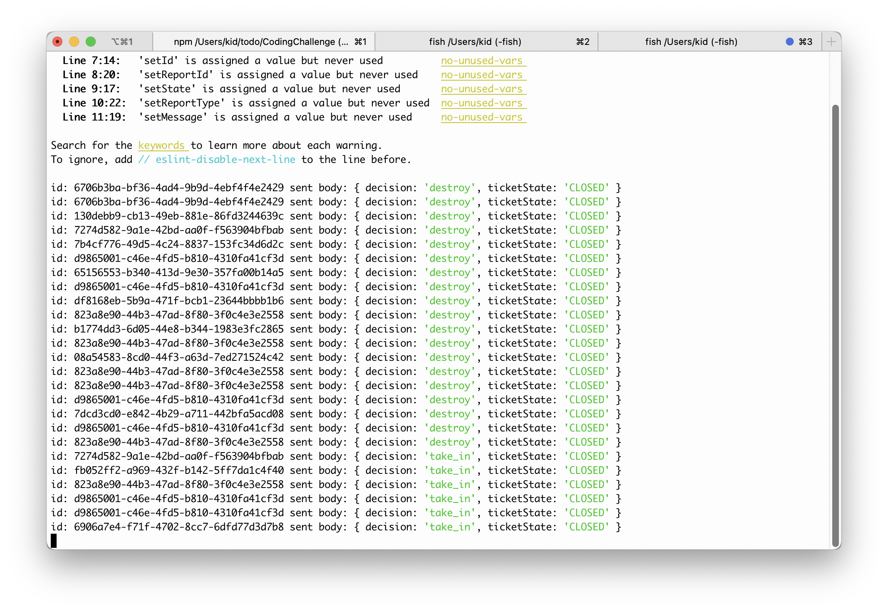

## Notes about my solution
- wrote the repo in an unix environment
- stack: reactjs & expressjs
- backend only serves JSON and logs POST request bodies (see below)
- didn't manage to do much in 3h because I had to refresh my React & Express knowlege on the fly

## How to run
- `$ npm install`
- `$ npm start`



# Coding Challenge
```
 /^ ^\    Wuff! Happy to see you! :)
/ 0 0 \
V\ Y /V
 / - \
 |    \
 || (__V
```

We're excited that you're interested in performing the coding challenge.
The purpose of this test is to see how you approach problems as well as to evaluate the quality of your code. It is important to note that this is an opportunity for you to show what you can do best, and therefore it is totally okay if you only mock some parts of this challenge (e.g., backend, frontend) if this gives you more time to concentrate on what you can do best. Just show us whatever excites you! :) 

## Challenge description

For this challenge, imagine that you sit in a spaceship steering through an asteroide belt. Asteroides are flying towards you and if you don't take action, they might demolish your ship. The first idea would be of course to take your awesome spacelaser and shoot all of them. But right before you start doing so, you notice that some of the asteroids are actually space puppies! These, you'd never want to shoot but instead take on board. So your task is now to build an application which helps the crew to quickly classify pieces in their way and then take appropriate action. What you already have is the output file of your image recognition system, which you can find as "sample report".

A little more concrete:
The challenge is to create a small full stack application for our space laser team that consists of a server and a web based UI in order to manage incoming pieces.

The UI should look something like:


We provide an example report ([`data/reports.json`](data/reports.json)) which you can use as the input from your image classification system. For each piece, the system will tell you what it has classified the object as (e.g., space trash, puppy). The task of the UI is to give the crew a chance to decide whether to take in or shoot each object based on the analysis. The two buttons in the UI should do a call to your backend service in order to trigger these actions. You are free to implement the action as you want, however the resolving should be defined as a `PUT` request to an endpoint with this structure `/reports/:reportId`. An example request for how to update a report is in [`data/update_ticket_request.json`](data/update_ticket_request.json).


## Instructions
- Please don't spend more than **3 hours**.
- Choose whatever frameworks you are comfortable with and that lets you achieve a solution in the given time limit. Please nothing too esoteric. We prefer Java, Ruby, Node.js, Python or Elixir.
- Provide the solution source code either as zip or as a link to the code repository

## What we're looking for:
- Code quality
- Technical choices
- Solution Design


